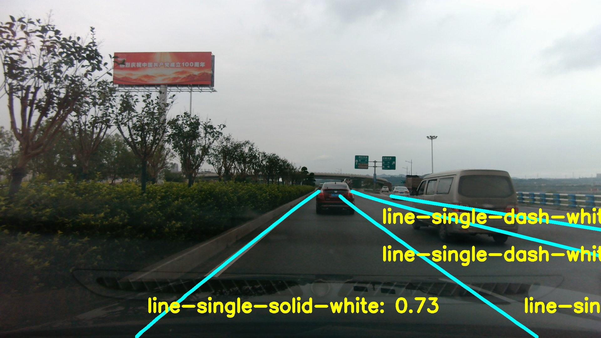

# Pointlanenet model training / inference / deploy in onnxruntime
## Introduction
This is my previous work on pointlane detection using pointlanenet  
This repo includes bothing model training and model inference in python and c++
 

## How to Run

### training
编辑model\models\cfgs\lane_exp.yml  
（1）resnet34 backbone  
（2）yolo csp backbone  
（3）NAS backbone  
其中_cls结尾的为同时训练车道线检测和车道线类别  
而_reg结尾的只训练车道线检测  
有预训练模型的先加载预训练模型  
可以通过变换类别来获取不同的模型  
```shell
## start training
python run.py
```

### inference
```shell
python inference.py
// 这里设置deploy = false
// DEPLOY = False
// BATCH_SIZE = 1
// MODEL_PATH = "tasks/test.pth" // 这是上一步训练获得的模型
// MODEL_CONFIG = "models/archs/lane_reg_nas.json" // 这是上一把训练模型的模型配置文件
```

### deploy
```shell
## export onnx and simplify
python inference.py
// 这里设置deploy = True
// DEPLOY = True
// BATCH_SIZE = 1
// MODEL_PATH = "tasks/test.pth" // 这是上一步训练获得的模型
// MODEL_CONFIG = "models/archs/lane_reg_nas.json" // 这是上一把训练模型的模型配置文件
python -m onnxsim .\lane_reg.onnx .\lane_reg_simplify.onnx
最后得到最终的简化模型
 
##  visual studio 2017 deploy SDK
打开pointlane\deploy\build\PROJECT_NAME.sln
将简化后的模型放到pointlane\deploy\model下面
然后按Ctrl + F5运行程序
```

 
 