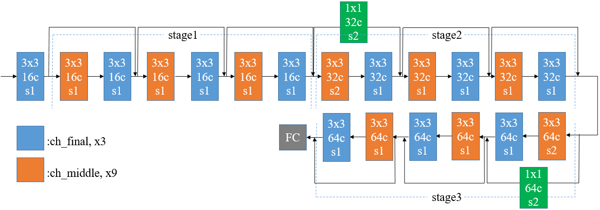
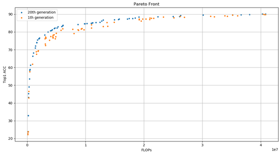

# A Guidance of EA Pruning (PruningEA)

## 1. 算法介绍

该场景主要是为了使用进化策略对CNN网络结构进行自动剪枝压缩，剪枝的搜索空间为需要剪枝的卷积层的输出通道数。维护一个包含N个个体的种群P，每个个体对应一个压缩的网络模型。通过交叉变异产生一个同样大小N的种群P’，每个压缩的网络模型通过进行training/valid，在验证集的Accuracy、FLOPs、参数量、Mac值、带宽等用户指定的指标，作为优化目标，来对个体进行排序选择，更新维持的种群P。

ResNet-20结构如下图所示，主要包括第一个卷积核和三个顺序stage，每个stage由三个ResBlock构成，当第一个ResBlock的shortcut连接两个通道数不一致的卷积层时，shortcut由1x1的上采样卷积核构成。



以ResNet-20网络为例，详细阐述自动剪枝压缩的过程：

 1. 编码：

    1.1. 编码表示对网络的卷积层的输出通道进行01编码，0表示剪掉该通道，1表示保留该通道。首先需要对网络结构进行分析，确定需要编码的卷积层；

    1.2. 对于上图中的蓝色块表示的存在shortcut连接的卷积层，当不存在1x1上采样操作时，需保证这两个卷积层的输出通道数一致，为了编码的方便，我们将这两个卷积层的输出通道数的编码也保持一致。我们以ch_final表示该部分编码，共3个；

    1.3. 对于上图中的橙色块表示的不存在shortcut连接的卷积层，可以任意剪枝，但需要保证不要全部剪掉。我们以ch_middle表示该部分编码，共9个。

 2. 搜索：

    2.1. 根据编码确定的【搜索空间】，通过交叉、变异等【进化操作】从种群P生成N个压缩模型的编码；

 3. 评估：

    3.1. 根据【进化操作】生成的N个编码，完成压缩模型的构建；

    3.2 执行【评估过程】，产生用户定义的所有评估结果；

 4. 优化：

    4.1. 调用【进化算法】，对种群P进行更新；

接下来重复【搜索】->【评估】->【优化】过程，完成整个进化自动剪枝流程，搜出Pareto前沿。搜索完剪枝模型之后，我们会对Pareto前沿的剪枝模型进行训练，得到剪枝后的模型的最终表现。

## 2. 使用指导

### 2.1 适用场景

EA Pruning适合网络的通道剪枝，分为两个阶段：搜索剪枝网络阶段+剪枝网络训练阶段。
本方法用于原始大模型进行剪枝压缩，可以用于各种场景。目前给的example是图像分类场景。

### 2.2 运行说明

在配置文件中进行参数配置，配置文件为：

- `examples/compression/prune_ea/prune.yml`

配置文件在`main.py`中直接传入给pipeline，两个过程会依次进行，搜索过程会搜出Pareto前沿，然后训练过程会把前沿的模型训到底，得到最终的表现。

`prune.yml` 的主要配置信息如下：

```yaml
nas:
    search_algorithm:           # 进化算法配置信息
        type: PruneEA
        codec: PruneCodec
        policy:
            length: 464         # 搜索的总通道数
            num_generation: 31  # 进化代数
            num_individual: 32  # 每一代的个体数
            random_samples: 64   # 随机初始化的模型数

    search_space:               # 搜索空间配置信息
        type: SearchSpace
        modules: ['backbone', 'head']
        backbone:
            type: ResNetGeneral
            stage: 3
            base_depth: 20
            base_channel: 16
        head:
            type: LinearClassificationHead
            base_channel: 64
            num_classes: 10
```

### 2.3 搜索空间配置

目前可以支持的剪枝网络为为ResNet系列分类网络如ResNet20，ResNet32，ResNet56等

```yaml
search_space:                   # ResNet20搜索空间
        type: SearchSpace
        modules: ['backbone', 'head']
        backbone:
            type: ResNetGeneral
            stage: 3
            base_depth: 20
            base_channel: 16
        head:
            type: LinearClassificationHead
            base_channel: 64
            num_classes: 10     # 分类数
```

目前可支持的网络如下：
| | search space | search algorithm |
| --- | --- | --- |
| ResNet-20 | base_depth: 20 | length:464       |
| ResNet-32 | base_depth: 32 | length:688       |
| ResNet-56 | base_depth: 56 | length: 1136     |

### 2.4 搜索算法

我们使用NSGA-III多目标优化进化算法进行pareto front的搜索。算法详情参考原论文[1]。

[1] Deb, Kalyanmoy, and Himanshu Jain. "An evolutionary many-objective optimization algorithm using reference-point-based nondominated sorting approach, part I: solving problems with box constraints." *IEEE Transactions on Evolutionary Computation* 18.4 (2013): 577-601.

### 2.5 输出结果描述

输出文件：

- 搜索到的帕雷托前沿的模型经充分训练后得到的模型及结果
- reports.csv 包含了搜索过程中所有模型的encoding/flops/parameters/accuracy；
- output.csv包含了搜索出来的pareto front的信息。

## 3. Benchmark Results

我们在example里提供了在CIFAR-10数据集上自动剪枝ResNet20网络的配置。实验结果如下：

- 搜出来的Pareto front,橙色表示第一代的Pareto front，蓝色表示第20代的Pareto front，可以明显看出，随着迭代数的增多，Pareto front向左上方移动。



- Pareto front上选3个不同剪枝比例的模型重训400epoch的结果。

  | model | FLOPs | TOP1 Acc | r_c |
  | --- | --- | --- | --- |
  | Baseline | 40.8M  | 91.45 | 1x |
  | IND1 | 30.11M | 91.22 | 0.74x |
  | IND2 | 19.14M | 90.9 | 0.46x |
  | IND3 | 6.14M  | 87.61 | 0.15x |
